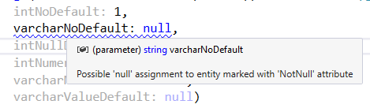

# SqlProcScaffold
Generate strongly typed C# SQL scaffold

## ToDo
* Improve default parameter parsing from sp_helptext
* Improve command line parser
* Get compile time errors for nullrequired strings

## Limitations
* Parameters may be re-ordered so that those with defaults come after those without

## Features

### NotNull hits
Use command line argument `-UseNotNullAttribute` to empower [Resharper](https://www.jetbrains.com/resharper/) to warn the developer that a parameter should not be null.

## Acknowledgments
* Ookii.CommandLine by Sven Groot (Ookii.org)