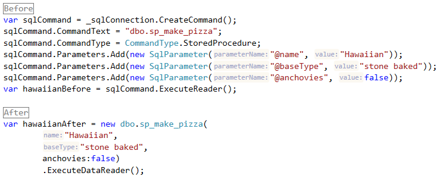

# SqlProcScaffold
Generate strongly typed C# SQL scaffold

For wrapping stored procs when Scaffold-DbContext doesn't seem to.

[Download](https://github.com/tekkies/SqlProcScaffold/releases/latest)

## Features

### Reduced boilerplate

### IDE support
Type ahead.

Parameter names and types.

### Only specify the params you neeed to
You don't have to specify all params.

[Resharper](https://www.jetbrains.com/resharper/) warns you missed a required proc param. `-UseNotNullAttribute`

## ToDo
* [ ] Improve default parameter parsing from sp_helptext
* [ ] Option to continue on error
* [X] Improve command line parser
* [X] Get compile time errors for nullrequired strings
* [X] Specify Namespace on command line

## Limitations
* Parameters may be re-ordered so that those with defaults come after those without

## Usage
~~~
Usage: SqlProcScaffold.dll [-ConnectionString] <String> [-NameSpace] <String> [[-Filter] <String>] [[-OutputFolder]
   <String>] [-Help] [-NoOverwrite] [-ShowLicense] [-UseNotNullAttribute] [-Verbose]

    -ConnectionString <String>
        Connection string to the SqlServer

    -NameSpace <String>
        Namespace for the generated code.

    -Filter <String>
        Filter procedures by name. Wildcard is %. e.g.
        dbo.sp_get%
         Default value: %.

    -OutputFolder <String>
        Filter procedures by name. Wildcard is %. e.g.
                dbo.sp_get%
             Default value: ..\..\..\..\SqlProcScaffoldTest\Procs.

    -Help [<Boolean>]
        Displays this help message. Alias: -?.

    -NoOverwrite [<Boolean>]
        Do not overwrite existing generated files.

    -ShowLicense [<Boolean>]
        Show license and acknowledgements.

    -UseNotNullAttribute [<Boolean>]
        Addorn code with [NotNull] attributes.  This helps ReSharper warn you that a parameter is required.

    -Verbose [<Boolean>]
        Print verbose information. Alias: -v.

Example:
    SqlProcScaffold.exe "Server=my..." MyNameSpace dbo.sp% C:\src\MyProj
~~~

## Acknowledgments
* Ookii.CommandLine by Sven Groot (Ookii.org)
